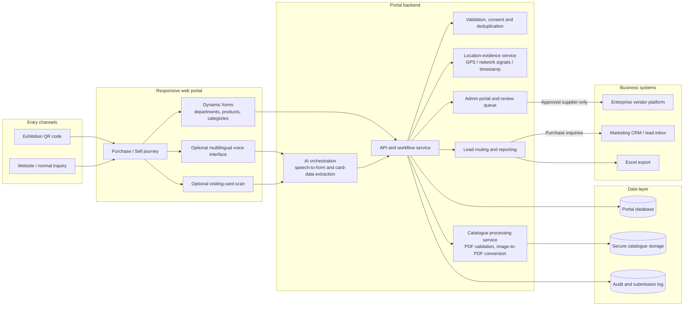

```mermaid
flowchart LR
    subgraph Channels["Entry channels"]
        QR[Exhibition QR code]
        WEB[Website / normal inquiry]
    end

    subgraph Portal["Responsive web portal"]
        UI[Purchase / Sell journey]
        FORM[Dynamic forms<br/>departments, products, categories]
        VOICE[Optional multilingual voice interface]
        CARD[Optional visiting-card scan]
    end

    subgraph Platform["Portal backend"]
        API[API and workflow service]
        VAL[Validation, consent and deduplication]
        LOC[Location-evidence service<br/>GPS / network signals / timestamp]
        DOC[Catalogue processing service<br/>PDF validation, image-to-PDF conversion]
        AI[AI orchestration<br/>speech-to-form and card-data extraction]
        ADMIN[Admin portal and review queue]
        LEADS[Lead routing and reporting]
    end

    subgraph Data["Data layer"]
        DB[(Portal database)]
        FILES[(Secure catalogue storage)]
        AUDIT[(Audit and submission log)]
    end

    subgraph Enterprise["Business systems"]
        VENDOR[Enterprise vendor platform]
        CRM[Marketing CRM / lead inbox]
        XLS[Excel export]
    end

    QR --> UI
    WEB --> UI
    UI --> FORM
    UI --> VOICE
    UI --> CARD
    FORM --> API
    VOICE --> AI
    CARD --> AI
    AI --> API

    API --> VAL
    API --> LOC
    API --> DOC
    API --> DB
    API --> AUDIT
    DOC --> FILES

    API --> ADMIN
    ADMIN -->|Approved supplier only| VENDOR

    API --> LEADS
    LEADS -->|Purchase inquiries| CRM
    LEADS --> XLS
```
