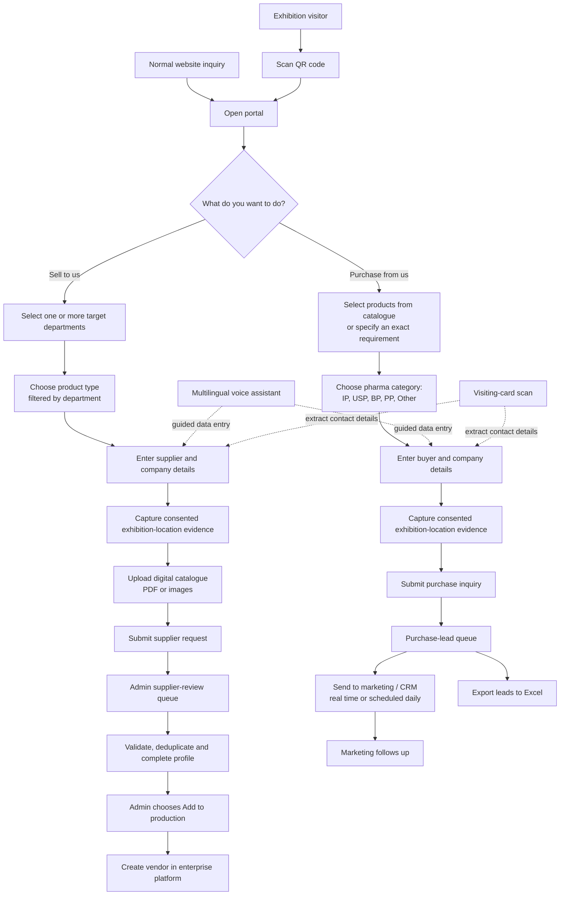

```mermaid
flowchart TD
    A[Exhibition visitor] --> B[Scan QR code]
    N[Normal website inquiry] --> C[Open the same portal]
    B --> C[Open portal]

    C --> D{What do you want to do?}

    D -->|Sell to us| S1[Select one or more target departments]
    S1 --> S2[Choose product type<br/>filtered by department]
    S2 --> S3[Enter supplier and company details]
    S3 --> S4[Capture consented exhibition-location evidence]
    S4 --> S5[Upload digital catalogue<br/>PDF or images]
    S5 --> S6[Submit supplier request]

    D -->|Purchase from us| P1[Select products from catalogue<br/>or specify an exact requirement]
    P1 --> P2[Choose pharma category:<br/>IP, USP, BP, PP, Other]
    P2 --> P3[Enter buyer and company details]
    P3 --> P4[Capture consented exhibition-location evidence]
    P4 --> P5[Submit purchase inquiry]

    V[Multilingual voice assistant] -. guided data entry .-> S3
    V -. guided data entry .-> P3
    C1[Visiting-card scan] -. extract contact details .-> S3
    C1 -. extract contact details .-> P3

    S6 --> SA[Admin supplier-review queue]
    SA --> SB[Validate, deduplicate and complete profile]
    SB --> SC[Admin chooses Add to production]
    SC --> SD[Create vendor in enterprise platform]

    P5 --> PA[Purchase-lead queue]
    PA --> PB[Send to marketing / CRM<br/>real time or scheduled daily]
    PB --> PC[Marketing follows up]
    PA --> PD[Export leads to Excel]
```