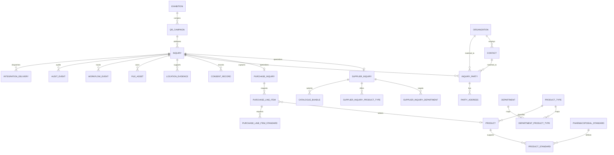

# Exhibition Portal Database Design

**Status:** Approved logical and physical design baseline  
**Database (applied):** MySQL 8 (user decision 3 September 2026; same engine as pharma-erp). Flyway V1–V5 in `backend/src/main/resources/db/migration/`.  
**Logical types in this document:** Originally written for PostgreSQL (`uuid`, `timestamptz`, `jsonb`, `text`). Keep them as the entity/invariant SSOT. The applied store maps them to `CHAR(36)`, `DATETIME(6)`, `JSON`, and `VARCHAR`/`TEXT`. Do **not** load `exhibition_portal_schema.sql`.  
**Application target:** Java 17 Spring Boot, with Flyway migrations. POC persistence is JDBC; ORM remains replaceable.  
**Scope:** Data design. The singleton DDL in this folder is the **historical full target**. The **applied POC schema** is `backend/src/main/resources/db/migration/` — see [BUILD-PLAN.md](BUILD-PLAN.md) §3.  
**Delivery:** [BUILD-PLAN.md](BUILD-PLAN.md)

### Scan-first / POC deviations (1 September 2026)

These are required for the scan-first visitor flow. They are applied in Flyway V1. They are **not** yet reflected as `NOT NULL` drops in `exhibition_portal_schema.sql`.

| Column | Singleton DDL | POC / scan-first |
|---|---|---|
| `inquiries.route` | `NOT NULL` (`SUPPLIER` / `PURCHASE`) | **Nullable** on draft until sell/buy. Required at submit. |
| `inquiry_parties.company_name_submitted` | `NOT NULL` | **Nullable**. Buyer company must not block submit. Supplier company is still required by service rules. |
| Consent uniqueness vs revocation | One current row *and* revocation as a new event | **Append-only.** Current consent is the latest row by `decided_at` per `(inquiry_id, purpose)`. Never UPDATE a prior GRANT/DECLINE. |
| `app_users.password_hash` | Not in singleton DDL (SSO `external_subject`) | **POC V4** local HTTP Basic. |
| `review_cases.open_supplier_key` | Partial unique index in PostgreSQL | **POC V4** nullable unique column, set to `supplier_inquiry_id` while the case is open and `NULL` when closed. MariaDB rejects generated `CASE`/`IF` over `CHAR(36)`. |
| `export_jobs` file pointer | `file_asset_id` (requires `inquiries`) | **POC V4** `storage_key` on disk; exports are not one inquiry. |

`EXHIBITION_QR` still needs `qr_campaign_id`; POC seeds campaign `22222222-2222-4222-8222-222222222222`. Supplier product types persist as `(inquiry_id, department_id, product_type_id)`. **V5:** `integration_deliveries` destinations are POC stubs (`poc-mailbox`, `poc-vendor-stub`), not live systems.

POC **audit:** `workflow_events` on create/submit/review/outbox. **V3–V5:** `audit_events` also on file, consent, Add to production, reject, export, and outbox enqueue/retry/success/fail. Metadata must not include email, phone, or filenames.

## 1. Design outcome

The portal has one durable inquiry record which branches into two governed workflows:

- **Sell to us:** a supplier candidate is reviewed by an internal user and is sent to the enterprise vendor platform only after explicit approval.
- **Purchase from us:** a buyer's request becomes a marketing lead and is routed to the CRM/lead inbox and/or controlled Excel export.

The portal is the system of record for the submitted inquiry, consent, location evidence, review history, and delivery outcome. The vendor platform remains the system of record for approved vendors, and the CRM/marketing destination remains the system of record for commercial follow-up.

## 2. Conventions and guardrails

| Rule | Decision |
|---|---|
| Primary keys | `uuid`, generated by the application. IDs are never business identifiers. |
| Public identifier | `inquiries.reference_code` is a unique human-safe reference shown to the visitor. |
| Time | Every event time is `timestamptz`, stored in UTC. |
| Statuses | Use `text` columns constrained by `CHECK` constraints or reference tables, not PostgreSQL enums. Status vocabulary can then evolve safely. |
| Core business data | Normalized relational tables. `jsonb` is reserved for constrained technical metadata such as an audit context or external-provider receipt, never for inquiry details, taxonomy, or workflow state. |
| Files | Files live in secure object storage. The database stores metadata, storage key, digest, security scan status, processing status, and lineage only. |
| Deletion | No routine hard deletion of submitted inquiries, reviews, audit events, or delivery history. Retention jobs may purge sensitive values while retaining an auditable outcome. |
| Taxonomy | Departments, product types, products, and pharmacopoeial standards are admin managed and archived instead of physically deleted when referenced. |

All mutable tables include `created_at timestamptz not null` and `updated_at timestamptz not null`. Immutable event tables include `occurred_at timestamptz not null` instead of `updated_at`.

## 3. Core entity map

## 4. Entry, identity, and inquiry tables

### `exhibitions`

Defines a physical exhibition and the evidence boundary used by its QR journeys.

| Column | PostgreSQL type | Rules / meaning |
|---|---|---|
| `id` | `uuid` | Primary key. |
| `name` | `text` | Required. |
| `starts_at`, `ends_at` | `timestamptz` | Required; end must be after start. |
| `timezone_name` | `text` | IANA zone, required for operational display. |
| `venue_name` | `text` | Nullable. |
| `geofence_latitude`, `geofence_longitude` | `numeric(9,6)` | Nullable reference point; not a visitor location. |
| `geofence_radius_m` | `integer` | Nullable; positive when supplied. |
| `status` | `text` | `DRAFT`, `ACTIVE`, `CLOSED`, or `ARCHIVED`. |

### `qr_campaigns`

Each QR code or campaign link can be attributed to one exhibition, stall, market, or promotion.

| Column | PostgreSQL type | Rules / meaning |
|---|---|---|
| `id` | `uuid` | Primary key. |
| `exhibition_id` | `uuid` | Nullable FK to `exhibitions`; null for a reusable non-exhibition campaign. |
| `code` | `text` | Unique, non-guessable campaign code. |
| `label` | `text` | Admin-visible label such as a stall or event. |
| `landing_route` | `text` | `CHOICE`, `SUPPLIER`, or `PURCHASE`. |
| `active_from`, `active_until` | `timestamptz` | Nullable availability window. |
| `is_active` | `boolean` | Required; default true. |

### `inquiries`

The top-level record for every public journey. It persists even when a downstream delivery fails.

| Column | PostgreSQL type | Rules / meaning |
|---|---|---|
| `id` | `uuid` | Primary key. |
| `reference_code` | `text` | Unique visitor-facing confirmation reference. |
| `route` | `text` | `SUPPLIER` or `PURCHASE`; immutable after first submission. **POC:** nullable until the visitor chooses a route. |
| `entry_channel` | `text` | `EXHIBITION_QR`, `WEBSITE`, `DIRECT`, or future approved channel. |
| `qr_campaign_id` | `uuid` | Nullable FK to `qr_campaigns`. |
| `exhibition_id` | `uuid` | Nullable FK to `exhibitions`; copied from the campaign at creation for durable attribution. |
| `lifecycle_state` | `text` | `DRAFT`, `SUBMITTED`, `CANCELLED`, `ARCHIVED`, or `RETENTION_PURGED`. |
| `submitted_at` | `timestamptz` | Nullable until submitted; immutable thereafter. |
| `submitted_language_code` | `varchar(10)` | Nullable BCP 47 language used by the visitor. |

**Constraints:** `submitted_at is not null` when `lifecycle_state = 'SUBMITTED'`; exactly one child row must exist in the appropriate route table before submission. The latter is enforced in the service transaction, with a database reconciliation check.

### `organizations`

Canonical company candidate used for deduplication and later vendor matching. It does not replace the original submitted snapshot.

| Column | PostgreSQL type | Rules / meaning |
|---|---|---|
| `id` | `uuid` | Primary key. |
| `legal_name` | `text` | Required. |
| `normalized_name` | `text` | Required normalized comparison key; indexed, not globally unique. |
| `website_url` | `text` | Nullable. |
| `tax_identifier_encrypted` | `bytea` | Nullable, only if the business process requires it. |
| `match_state` | `text` | `UNVERIFIED`, `CONFIRMED`, or `MERGED`. |
| `merged_into_organization_id` | `uuid` | Nullable self-FK; populated only for a resolved duplicate. |

### `contacts`

Canonical person/contact candidate. A contact can be associated with one organization initially; historical submitted values remain in `inquiry_parties`.

| Column | PostgreSQL type | Rules / meaning |
|---|---|---|
| `id` | `uuid` | Primary key. |
| `organization_id` | `uuid` | Nullable FK to `organizations`. |
| `first_name`, `last_name` | `text` | Nullable individually; at least one is required when a contact exists. |
| `email_normalized` | `text` | Nullable lower-cased/trimmed email; indexed, not globally unique. |
| `phone_e164` | `varchar(20)` | Nullable normalized phone number; indexed, not globally unique. |
| `job_title` | `text` | Nullable. |
| `match_state` | `text` | `UNVERIFIED`, `CONFIRMED`, or `MERGED`. |

### `inquiry_parties`

An immutable submitted snapshot of the individual and company details. This protects the original submission from later edits to canonical identities.

| Column | PostgreSQL type | Rules / meaning |
|---|---|---|
| `id` | `uuid` | Primary key. |
| `inquiry_id` | `uuid` | Required FK to `inquiries`. |
| `role` | `text` | `SUPPLIER_CONTACT` or `BUYER_CONTACT`; unique per inquiry for the initial release. |
| `organization_id`, `contact_id` | `uuid` | Nullable FK links after matching/review. |
| `company_name_submitted` | `text` | Required for supplier submit. **POC:** nullable so a buyer without a company can submit. |
| `person_name_submitted` | `text` | Required. |
| `email_submitted` | `text` | Required. |
| `email_normalized` | `text` | Required comparison key. |
| `phone_submitted`, `phone_e164` | `text`, `varchar(20)` | Nullable raw display value and normalized comparison value. |
| `job_title_submitted` | `text` | Nullable. |

### `party_addresses`

Postal/business address, intentionally separate from physical location evidence.

| Column | PostgreSQL type | Rules / meaning |
|---|---|---|
| `id` | `uuid` | Primary key. |
| `inquiry_party_id` | `uuid` | Required FK to `inquiry_parties`. |
| `address_kind` | `text` | `BUSINESS`, `POSTAL`, or `OTHER`. |
| `line_1`, `line_2`, `city`, `state_region`, `postal_code`, `country_code` | `text` / `char(2)` | Address values; country is ISO 3166-1 alpha-2 when supplied. |

## 5. Admin-managed business taxonomy

The taxonomy is valid-time configuration. A referenced entry is archived, never deleted.

### `departments`

| Column | PostgreSQL type | Rules / meaning |
|---|---|---|
| `id` | `uuid` | Primary key. |
| `code` | `varchar(50)` | Unique stable business key. |
| `name` | `text` | Unique among active rows. |
| `description` | `text` | Nullable. |
| `display_order` | `integer` | Required. |
| `is_active` | `boolean` | Required; default true. |

### `product_types`

| Column | PostgreSQL type | Rules / meaning |
|---|---|---|
| `id` | `uuid` | Primary key. |
| `code` | `varchar(50)` | Unique stable business key. |
| `name` | `text` | Required. |
| `description` | `text` | Nullable. |
| `is_active`, `display_order` | `boolean`, `integer` | Required configuration controls. |

### `department_product_types`

The many-to-many mapping that drives the supplier form. A product type is selectable only when mapped to a selected department.

| Column | PostgreSQL type | Rules / meaning |
|---|---|---|
| `department_id` | `uuid` | FK to `departments`; composite primary key part. |
| `product_type_id` | `uuid` | FK to `product_types`; composite primary key part. |
| `is_active`, `display_order` | `boolean`, `integer` | Required configuration controls. |

### `products`

The Sarv catalogue maintained by administrators. It represents a product, API, intermediate, phytochemical, or extract; it does not represent a buyer's free-text requirement.

| Column | PostgreSQL type | Rules / meaning |
|---|---|---|
| `id` | `uuid` | Primary key. |
| `product_type_id` | `uuid` | Required FK to `product_types`. |
| `code` | `varchar(80)` | Unique internal catalogue code. |
| `name` | `text` | Required display name. |
| `cas_number` | `varchar(32)` | Nullable; indexed but not unique because a commercial presentation may differ. |
| `product_family` | `text` | `API`, `INTERMEDIATE`, `PHYTOCHEMICAL`, `HERBAL_EXTRACT`, `ONCOLOGY`, or approved future value. |
| `description` | `text` | Nullable. |
| `is_active`, `display_order` | `boolean`, `integer` | Required configuration controls. |

### `pharmacopoeial_standards`

Controlled values such as `IP`, `USP`, `BP`, `EP`, and `FP` if the business elects to use it. `PP` is not introduced because it was confirmed as a typo.

| Column | PostgreSQL type | Rules / meaning |
|---|---|---|
| `id` | `uuid` | Primary key. |
| `code` | `varchar(16)` | Unique controlled code. |
| `name` | `text` | Required human name. |
| `is_active` | `boolean` | Required; default true. |

### `product_standards`

| Column | PostgreSQL type | Rules / meaning |
|---|---|---|
| `product_id` | `uuid` | FK to `products`; composite primary key part. |
| `standard_id` | `uuid` | FK to `pharmacopoeial_standards`; composite primary key part. |
| `notes` | `text` | Nullable qualification such as grade or submission status. |

## 6. Supplier inquiry route

### `supplier_inquiries`

One-to-one extension for an inquiry whose route is `SUPPLIER`.

| Column | PostgreSQL type | Rules / meaning |
|---|---|---|
| `inquiry_id` | `uuid` | Primary key and FK to `inquiries`. |
| `review_state` | `text` | `DRAFT`, `SUBMITTED`, `UNDER_REVIEW`, `NEEDS_INFORMATION`, `APPROVED`, or `REJECTED`. |
| `assigned_to_user_id` | `uuid` | Nullable FK to `app_users`. |
| `production_state` | `text` | `NOT_REQUESTED`, `QUEUED`, `IN_PROGRESS`, `SUCCEEDED`, or `FAILED`. |
| `approved_at` | `timestamptz` | Nullable; required for `APPROVED`. |
| `approved_by_user_id` | `uuid` | Nullable FK to `app_users`; required for `APPROVED`. |

### `supplier_inquiry_departments`

| Column | PostgreSQL type | Rules / meaning |
|---|---|---|
| `inquiry_id` | `uuid` | FK to `supplier_inquiries`; composite primary key part. |
| `department_id` | `uuid` | FK to `departments`; composite primary key part. |

### `supplier_inquiry_product_types`

This composite design enforces that every supplier-selected product type belongs to a department selected in the same inquiry.

| Column | PostgreSQL type | Rules / meaning |
|---|---|---|
| `inquiry_id` | `uuid` | Composite primary key part. |
| `department_id` | `uuid` | Together with `inquiry_id`, FK to `supplier_inquiry_departments`. |
| `product_type_id` | `uuid` | Together with `department_id`, FK to `department_product_types`. |

### `catalogue_bundles`

One supplier may submit one or more catalogue bundles. An image bundle is converted to a derived PDF without deleting its originals.

| Column | PostgreSQL type | Rules / meaning |
|---|---|---|
| `id` | `uuid` | Primary key. |
| `supplier_inquiry_id` | `uuid` | Required FK to `supplier_inquiries`. |
| `submission_format` | `text` | `PDF`, `IMAGES`, or `MIXED`. |
| `processing_state` | `text` | `PENDING_SCAN`, `PROCESSING`, `READY`, `FAILED`, or `REJECTED`. |
| `failure_reason` | `text` | Nullable operator-safe error description. |
| `submitted_at`, `completed_at` | `timestamptz` | Submission time and nullable completion time. |

## 7. Purchase inquiry route

### `purchase_inquiries`

One-to-one extension for an inquiry whose route is `PURCHASE`.

| Column | PostgreSQL type | Rules / meaning |
|---|---|---|
| `inquiry_id` | `uuid` | Primary key and FK to `inquiries`. |
| `lead_state` | `text` | `DRAFT`, `SUBMITTED`, `QUEUED`, `DISPATCHED`, `DELIVERY_FAILED`, `IN_PROGRESS`, `CLOSED`, or `DISQUALIFIED`. |
| `assigned_to_user_id` | `uuid` | Nullable FK to `app_users`. |
| `first_dispatched_at` | `timestamptz` | Nullable. |
| `marketing_notes` | `text` | Nullable internal notes; never shown to the visitor. |

### `purchase_line_items`

Supports both a chosen Sarv catalogue product and a free-text requirement. At least one is mandatory; both may be set if the buyer selects a product and adds a specification.

| Column | PostgreSQL type | Rules / meaning |
|---|---|---|
| `id` | `uuid` | Primary key. |
| `purchase_inquiry_id` | `uuid` | Required FK to `purchase_inquiries`. |
| `product_id` | `uuid` | Nullable FK to `products`. |
| `requirement_text` | `text` | Nullable exact product/specification supplied by the buyer. |
| `quantity_text` | `text` | Nullable human-entered expected quantity; avoids false precision before unit rules are agreed. |
| `display_order` | `integer` | Required. |

**Constraint:** `product_id is not null OR requirement_text is not null`.

### `purchase_line_item_standards`

| Column | PostgreSQL type | Rules / meaning |
|---|---|---|
| `purchase_line_item_id` | `uuid` | FK to `purchase_line_items`; composite primary key part. |
| `standard_id` | `uuid` | FK to `pharmacopoeial_standards`; composite primary key part. |

## 8. Files, AI assistance, consent, and location evidence

### `file_assets`

The generic, metadata-only asset register. It supports catalogue uploads, business-card images, audio assistance, and derived PDFs.

| Column | PostgreSQL type | Rules / meaning |
|---|---|---|
| `id` | `uuid` | Primary key. |
| `inquiry_id` | `uuid` | Required FK to `inquiries`. |
| `catalogue_bundle_id` | `uuid` | Nullable FK to `catalogue_bundles`. |
| `source_asset_id` | `uuid` | Nullable self-FK; identifies an original asset from which a PDF or other derivative was created. |
| `purpose` | `text` | `CATALOGUE_ORIGINAL`, `CATALOGUE_DERIVED_PDF`, `BUSINESS_CARD`, or `VOICE_INPUT`. |
| `original_filename`, `media_type` | `text` | Required metadata. |
| `byte_size` | `bigint` | Required, positive. |
| `sha256_digest` | `char(64)` | Required integrity digest. |
| `storage_key` | `text` | Unique non-public object-storage key. |
| `security_scan_state` | `text` | `PENDING`, `CLEAN`, `REJECTED`, or `FAILED`. |
| `processing_state` | `text` | `UPLOADED`, `PROCESSING`, `READY`, `FAILED`, or `PURGED`. |
| `retention_until` | `timestamptz` | Required per policy. |

### `consent_records`

Consent is a record, not a boolean on the inquiry. This retains the wording version and the affirmative/negative outcome.

| Column | PostgreSQL type | Rules / meaning |
|---|---|---|
| `id` | `uuid` | Primary key. |
| `inquiry_id` | `uuid` | Required FK to `inquiries`. |
| `purpose` | `text` | `LOCATION_EVIDENCE`, `BUSINESS_CARD_EXTRACTION`, `VOICE_PROCESSING`, or another approved purpose. |
| `policy_version` | `text` | Required, immutable version of the shown notice. |
| `decision` | `text` | `GRANTED`, `DECLINED`, or `REVOKED`. |
| `decided_at` | `timestamptz` | Required. |
| `revoked_at` | `timestamptz` | Nullable. |

**Constraint:** append-only inserts. Current consent for a purpose is the latest `decided_at` row. Revocation inserts `REVOKED` with `revoked_at`; prior GRANT/DECLINE rows are not updated. Applied in Flyway V3.

### `location_evidence`

Location is voluntary and evidence is separate from the postal address. The recommended privacy-preserving policy is:

1. capture only after a `LOCATION_EVIDENCE` consent record is granted;
2. use the exhibition geofence to compute `is_on_site` and `distance_to_event_m`;
3. retain encrypted precise coordinates for **14 days** for operational verification only;
4. purge the encrypted coordinates after that period while retaining the consent, source, captured time, accuracy, on-site result, and purge event;
5. never store a raw IP address in this table.

| Column | PostgreSQL type | Rules / meaning |
|---|---|---|
| `id` | `uuid` | Primary key. |
| `inquiry_id` | `uuid` | Required FK to `inquiries`. |
| `consent_id` | `uuid` | Required FK to a granted `consent_records` row. |
| `exhibition_id` | `uuid` | Nullable FK to `exhibitions`. |
| `source` | `text` | `BROWSER_GPS`, `NETWORK_DERIVED`, `QR_EVENT`, `DECLINED`, or `UNAVAILABLE`. |
| `captured_at` | `timestamptz` | Required. |
| `accuracy_m` | `integer` | Nullable positive accuracy radius. |
| `is_on_site` | `boolean` | Nullable when no assessment can be made. |
| `distance_to_event_m` | `integer` | Nullable derived distance. |
| `latitude_encrypted`, `longitude_encrypted` | `bytea` | Nullable encrypted values, purged at `precise_data_purge_at`. |
| `encryption_key_reference` | `text` | Nullable key-management reference; never a key. |
| `precise_data_purge_at`, `purged_at` | `timestamptz` | Required planned purge and nullable actual purge. |

### `ai_assistance_sessions`, `ai_extractions`, and `ai_extracted_fields`

AI may suggest data but cannot silently write user-confirmed fields or approve a supplier.

| Table | Essential columns | Purpose |
|---|---|---|
| `ai_assistance_sessions` | `id`, `inquiry_id`, `consent_id`, `feature`, `language_code`, `state`, `provider_request_reference`, `started_at`, `completed_at` | One optional multilingual voice or business-card-assisted interaction. |
| `ai_extractions` | `id`, `session_id`, `input_asset_id`, `state`, `provider_model_reference`, `completed_at` | One extraction attempt, optionally tied to a card image or audio asset. |
| `ai_extracted_fields` | `id`, `extraction_id`, `field_key`, `proposed_value_text`, `confidence_score`, `review_state`, `reviewed_by_user_id`, `reviewed_at` | Field-level proposal with `PENDING`, `ACCEPTED`, `CORRECTED`, or `REJECTED` review state. |

## 9. Workflow, administration, integrations, and audit

### `app_users`, `roles`, and `user_roles`

The portal authorizes internal staff; visitor authentication is not needed for the pilot.

| Table | Essential columns | Constraints |
|---|---|---|
| `app_users` | `id`, `external_subject`, `email_normalized`, `display_name`, `status` | `external_subject` and normalized email are unique. **POC V4** also has `password_hash` for local HTTP Basic (`{noop}…`). Public hosts must set `EXHIBITION_STAFF_BOOTSTRAP_PASSWORD` (bcrypt rotate on start). Replace with SSO; do not ship noop hashes. |
| `roles` | `id`, `code`, `name` | Codes include `ADMIN`, `SUPPLIER_REVIEWER`, `MARKETING`, `EXPORTER`, and `TAXONOMY_MANAGER`. |
| `user_roles` | `user_id`, `role_id` | Composite primary key. |

### `review_cases` and `review_decisions`

| Table | Essential columns | Purpose |
|---|---|---|
| `review_cases` | `id`, `supplier_inquiry_id`, `state`, `assigned_to_user_id`, `opened_at`, `closed_at` | Review queue record; one open case per supplier inquiry. |
| `review_decisions` | `id`, `review_case_id`, `decision`, `reason_code`, `notes`, `decided_by_user_id`, `decided_at` | Append-only `REQUEST_INFORMATION`, `APPROVE`, or `REJECT` decisions. Approval is required before vendor delivery. |
| `deduplication_matches` | `id`, `inquiry_id`, `candidate_organization_id`, `candidate_contact_id`, `score`, `state`, `resolved_by_user_id`, `resolved_at` | Reviewable duplicate candidates; never silently merges source records. |

### `workflow_events`

Append-only state transition history for both routes.

| Column | PostgreSQL type | Rules / meaning |
|---|---|---|
| `id` | `uuid` | Primary key. |
| `inquiry_id` | `uuid` | Required FK to `inquiries`. |
| `workflow` | `text` | `INQUIRY`, `SUPPLIER_REVIEW`, `VENDOR_DELIVERY`, `PURCHASE_LEAD`, or `CRM_DELIVERY`. |
| `from_state`, `to_state` | `text` | Nullable source state and required target state. |
| `actor_kind`, `actor_user_id` | `text`, `uuid` | `VISITOR`, `USER`, `SYSTEM`, or `INTEGRATION`; user FK is nullable. |
| `reason_code`, `notes` | `text` | Nullable. |
| `occurred_at` | `timestamptz` | Required immutable time. |

### `integration_deliveries`

Generic outbox/delivery record. It provides transactional idempotency, retry visibility, and a durable outcome for vendor and marketing integrations.

| Column | PostgreSQL type | Rules / meaning |
|---|---|---|
| `id` | `uuid` | Primary key. |
| `inquiry_id` | `uuid` | Required FK to `inquiries`. |
| `delivery_kind` | `text` | `VENDOR_UPSERT`, `MARKETING_LEAD`, or future approved delivery. |
| `destination` | `text` | Named enterprise vendor platform, CRM, or lead inbox. |
| `idempotency_key` | `text` | Unique; generated before the outbound request. |
| `state` | `text` | `PENDING`, `IN_PROGRESS`, `SUCCEEDED`, `RETRY_SCHEDULED`, `FAILED`, or `CANCELLED`. |
| `attempt_count` | `integer` | Required; default 0. |
| `next_attempt_at`, `last_attempt_at` | `timestamptz` | Nullable retry scheduling data. |
| `external_reference` | `text` | Nullable vendor/CRM response identifier. |
| `last_error_code`, `last_error_message` | `text` | Nullable sanitized failure information. |
| `request_payload_version` | `varchar(32)` | Required mapping/payload contract version. |

### `export_jobs`

An export is a controlled, auditable generated file rather than a direct table download.

| Column | PostgreSQL type | Rules / meaning |
|---|---|---|
| `id` | `uuid` | Primary key. |
| `requested_by_user_id` | `uuid` | Required FK to `app_users`. |
| `scope` | `text` | `PURCHASE_LEADS`, `SUPPLIER_INQUIRIES`, or approved future scope. |
| `filter_summary` | `jsonb` | Narrow technical snapshot of approved filter inputs; not a source of business truth. |
| `state` | `text` | `QUEUED`, `GENERATING`, `READY`, `FAILED`, or `EXPIRED`. |
| `file_asset_id` | `uuid` | Nullable FK to `file_assets` for the generated xlsx. **POC V4** uses `storage_key` instead because `file_assets.inquiry_id` is required. |
| `expires_at`, `generated_at` | `timestamptz` | Required expiry and nullable completion time. |

### `audit_events`

Append-only, authorization-aware audit history. Audit metadata must not duplicate sensitive values.

| Column | PostgreSQL type | Rules / meaning |
|---|---|---|
| `id` | `uuid` | Primary key. |
| `inquiry_id` | `uuid` | Nullable FK for inquiry-related events. |
| `entity_type`, `entity_id` | `text`, `uuid` | Required audited target. |
| `event_type` | `text` | Required stable event key. |
| `actor_kind`, `actor_user_id` | `text`, `uuid` | Actor identity; user is nullable for visitor/system events. |
| `occurred_at` | `timestamptz` | Required immutable time. |
| `metadata` | `jsonb` | Minimal non-sensitive technical context such as status transition, export scope, or provider receipt reference. |

## 10. Key relationship and deletion rules

| Parent | Child | Rule |
|---|---|---|
| `inquiries` | route extensions, parties, consent, evidence, assets, workflow, audit, deliveries | `RESTRICT` for submitted records; retention/pseudonymization is an explicit workflow. |
| `supplier_inquiries` | selected departments/types, catalogue bundles, review cases | `CASCADE` only while the parent is an unsubmitted draft; otherwise restricted by service policy. |
| taxonomy tables | inquiry selection/history rows | `RESTRICT`; administrators archive taxonomies instead. |
| `catalogue_bundles` | file assets | `RESTRICT` after submission to preserve evidence and lineage. |
| `organizations` / `contacts` | inquiry snapshots | `SET NULL` for the optional canonical match only; snapshots remain intact. |
| `app_users` | approvals, exports, audit events | `RESTRICT`; deactivate user accounts rather than deleting them. |

## 11. Initial indexes and constraints

The initial migration set should create at least the following, in addition to primary and unique keys.

| Table | Index / constraint | Query or integrity reason |
|---|---|---|
| `inquiries` | `(route, lifecycle_state, submitted_at desc)` | Admin queues and reporting. |
| `inquiries` | `(qr_campaign_id, submitted_at desc)` | Exhibition/campaign conversion reporting. |
| `supplier_inquiries` | `(review_state, assigned_to_user_id, updated_at desc)` | Supplier-review work queue. |
| `purchase_inquiries` | `(lead_state, assigned_to_user_id, updated_at desc)` | Marketing queue. |
| `inquiry_parties` | `(email_normalized)`, `(phone_e164)`, `(company_name_submitted)` | Candidate duplicate matching; none should be globally unique. |
| `organizations` | `(normalized_name)` | Duplicate-review search. |
| `products` | unique `(code)` and index `(product_type_id, is_active, display_order)` | Admin product management and buyer product picker. |
| `department_product_types` | unique `(department_id, product_type_id)` | Valid supplier-form mapping. |
| `file_assets` | unique `(storage_key)`; index `(inquiry_id, purpose, processing_state)` | Secure asset lookup and processing queue. |
| `integration_deliveries` | unique `(idempotency_key)`; `(state, next_attempt_at)` | Exactly-once intent and retry worker. |
| `workflow_events` | `(inquiry_id, occurred_at desc)` | Inquiry timeline. |
| `audit_events` | `(inquiry_id, occurred_at desc)` and `(entity_type, entity_id, occurred_at desc)` | Traceability. |

## 12. Delivery sequence after this design

The sequenced Java + React plan is **[BUILD-PLAN.md](BUILD-PLAN.md)**. In short:

1. Confirm the legal/privacy wording and retention periods, especially for location, business-card images, and voice data.
2. Define the initial admin taxonomy: departments, their valid product types, Sarv product catalogue entries, and supported pharmacopoeial standards.
3. Apply BUILD-PLAN §3 schema fixes, then produce Flyway migrations from this document (do not apply the singleton DDL as production V1).
4. Implement the supplier and purchase flows, then add asynchronous catalogue processing and integration outbox workers.
5. Add CRM/vendor platform mappings only after their API, identity-match, and ownership rules are confirmed.

## 13. Explicitly deferred decisions

- The concrete enterprise vendor platform and CRM/lead destination.
- Exact field-level retention durations other than the recommended 14-day precise-location window.
- The product master import/synchronization contract. The initial source is admin-managed.
- Final role membership, audit retention, export retention, storage provider, encryption/KMS provider, and AI provider.
- Exact presentation of product quantities, units of measure, regulatory documents, and vendor master fields required by the enterprise platform.
