# Sarv Biolabs Exhibition Portal - Complete Project Context

> **Purpose:** This is the durable handoff for any future AI agent, designer, developer, or stakeholder working on the portal. It consolidates the accessible project conversations, source material, HLD, database design, Stitch work, local exported screens, and local skills.
>
> **Assembled:** 21 August 2026 · **Specs relocated:** 1 September 2026 (`specs/`)
>
> **Current stage:** Phases 1–7 are running: visitor API, files/consent/audit, `/staff` review, outbox stubs, local card-QR assist, and **exhibition pilot entry** (campaign QR codes, shared-device session isolation, website/direct channels, poor-network banners). Cloud OCR, voice, and live CRM/vendor APIs are **not** live. Public Windows Server: **Java 17** JAR + Jenkins (no Docker) — **[DEPLOY-WINDOWS.md](DEPLOY-WINDOWS.md)** (`http://43.225.195.200/`; in-page camera still needs HTTPS). Delivery sequence: **[BUILD-PLAN.md](BUILD-PLAN.md)**.

## 1. Read this first: the product in one page

Sarv Biolabs needs a reusable web inquiry portal. The immediate use case is an exhibition: a visitor reaches the portal through a Sarv QR code at the stall. The same portal must later support normal website/direct inquiries, rather than becoming a one-off exhibition form.

The portal has two deliberately different public journeys:

| Visitor-facing choice | Business meaning | Downstream outcome |
| --- | --- | --- |
| **I want to sell** | A potential supplier/vendor wants to offer products or capabilities to Sarv. | A governed supplier candidate enters an internal review queue. Only an explicit admin approval can create/update a vendor in the enterprise platform. |
| **I want to buy** | A potential Sarv customer wants a product or has a sourcing requirement. | A purchase inquiry becomes a marketing/sales lead, routed to the chosen CRM/lead inbox and available through controlled Excel export. |

The product principle is **one configurable platform, not two disconnected forms**. The public visitor journey is simple; the internal review, audit, file handling, and integration behavior are governed.

The strongest current UX decision is that the experience is **scan-first and auto-saved**. A visitor may scan both sides of a business card, upload images, or continue manually. OCR/AI may propose values, but the visitor reviews the usable name, work email, and mobile number (including country code) before route selection. That confirmed identity is used to create a resumable partial inquiry. Meaningful progress is saved server-side so a visitor who gets busy can later be contacted rather than lost.

The buyer route must be materially faster than the supplier route. Buyers are Sarv's potential customers and cannot be lost to a long B2B form. A buyer can submit after giving a saved contact and **one product-or-requirement statement**. Product-area search and specifications (quantity, pack size, standard, needed-by date, notes) are progressive and optional. A buyer company is helpful but must not block submission.

## 2. Decision precedence and terminology

Use this precedence when sources conflict:

1. The latest explicit user-approved decisions in the accessible task history.
2. The approved database design and the scan-first section of `.stitch/metadata.json` / `.stitch/MASTER_TASKS.md`.
3. The 11 current local final-flow exports in `.stitch/designs/`.
4. The original HLD, diagrams, and early desktop/mobile prototypes.

Several early assets deliberately remain as historical evidence. Do **not** reintroduce their obsolete long-form flow just because an old screen, checklist line, or screenshot contains it.

Terminology:

- **Supplier route / Sell to us / I want to sell:** vendor-intake route, not an online marketplace seller workflow.
- **Purchase route / Buy from us / I want to buy:** customer product inquiry, not procurement performed by Sarv.
- **Add to production:** an internal, explicit supplier approval action that triggers enterprise-vendor creation or update. It is never presented as a visitor action and never automated by AI.
- **Location evidence:** consented event-presence evidence, separate from a postal/business address. It is not a reason to capture undisclosed precise tracking.
- **Card scan:** an optional accelerator with a manual fallback. Extraction output is a suggestion until reviewed/corrected.

## 3. Business and domain context

Sarv Biolabs is a research-based Indian pharmaceutical manufacturer, positioned around specialty active pharmaceutical ingredients (APIs), intermediates, oncology products, phytochemical/phyto products, manufacturing quality, regulatory expertise, and a Himalayan-origin story. The supplied company brochure records WHO-GMP and ISO 14001:2015, ISO 9001:2015, and ISO 45001:2018 positioning, plus product ranges including Thiocolchicoside, Colchicine, Hyoscine derivatives, Paclitaxel/Docetaxel intermediates, oncology products, and phyto products.

Implications for the portal:

- It is a high-trust pharmaceutical B2B experience, not consumer health/wellness or a generic SaaS lead form.
- Supplier taxonomies must be configurable. Sarv covers APIs, intermediates, phytochemicals, herbal extracts, oncology, and evolving business categories; these must not be hard-coded into forms.
- Buyer product selection must support both a Sarv catalogue product and a free-text exact requirement.
- Pharmacopoeial standards are controlled values such as **IP, USP, BP, and EP**. `PP` appeared in the original verbal flow but was confirmed to be a typo; do not add it as a standard.

## 4. How the concept evolved

### 4.1 Initial concept and HLD direction

The original idea was a QR-led exhibition portal, later reusable from the normal website:

```text
Exhibition QR or normal website entry
  -> choose sell-to-us or purchase-from-us
  -> route-specific structured form
  -> governed internal action
```

The original supplier concept was: select one or more target departments, choose product types filtered by those departments, enter company/contact details, capture consented exhibition evidence, upload a digital catalogue (PDF or images, with image bundles converted to a review PDF), and submit to an internal supplier-review queue. The review team validates/deduplicates and can explicitly Add to production.

The original buyer concept was: select a catalogue product or provide an exact requirement, give purchaser details, submit, and route the resulting lead to marketing/CRM and controlled Excel export. The original version included a mandatory separate pharmacopeial/requirement-details step; that has since been deliberately removed from the minimum path.

The HLD was prepared after senior review of the early user-flow and system diagrams. It established the following logical layers:

```text
Entry channels
  Exhibition QR / normal website
        |
Responsive portal
  Sell and buy journeys, dynamic taxonomy, optional voice and card scan
        |
Portal workflow services
  API/access control, validation, consent, deduplication, location evidence,
  catalogue processing, AI orchestration, workflow/routing
        |
Secure data and internal administration
  Portal database, secure object storage, audit/consent log, review queues
        |
Enterprise integrations
  Approved supplier -> enterprise vendor platform
  Purchase lead -> CRM/marketing lead destination
  Authorized user -> controlled Excel export
```

The HLD remains the authoritative high-level architecture baseline. It intentionally does **not** pick final cloud, CRM, ERP, or AI providers.

### 4.2 Design exploration and approval

Three initial mobile visual directions were explored:

1. **Clinical Signal** - light, precise, exhibition-legible.
2. **Midnight Ledger** - premium dark and operational, better suited to internal/admin contexts.
3. **Alpine Origin** - Sarv's Himalayan-origin/quality story with scientific credibility.

The chosen final direction is **Alpine Blue** for the visitor portal, with **Alpine Blue After Dark** for internal/admin work. A senior specifically asked to maintain Sarv blue and to word visitor choices from the employee/visitor perspective: **“I want to sell”** and **“I want to buy”**, rather than corporate-centric labels.

A Stitch project was created: `Sarv Biolabs Exhibition Portal` (`16252155655979346180`). Both local design-system documents and the logo were imported into Stitch. Historic task messages say the project was created private; current `.stitch/metadata.json` says `visibility: PUBLIC`. This is a real status conflict: **verify visibility in Stitch before sharing any link or external asset.**

The first complete design cycle produced a 10-screen mobile flow and 10 desktop counterparts. Those desktop screens reflect the older, pre-card-scan flow and are not current. Do not use them as implementation requirements.

### 4.3 The decisive scan-first revision

The later approved revision changed information architecture, not the Alpine Blue design system:

- First screen: capture the **front and back** of a business card, with camera, upload, and manual continuation.
- Extract usable card/contact/company details and decode any QR payload on the card.
- A card QR payload is saved internally with the inquiry. **Do not redirect the visitor, expose the destination, or add an “open link” flow.** An earlier ideation response proposed a preview/open choice; the user explicitly superseded that proposal.
- The visitor confirms full name, work email, and mobile/country code. This creates or updates a partial inquiry record before route selection.
- Save every meaningful stage server-side: card images and extraction, contact confirmation, route, taxonomy selections, buyer requirement/options, and review edits. A visitor leaving mid-flow is still a follow-up opportunity.
- Replace long default profile forms with a smart details checkpoint: show extracted details first, ask only for genuinely missing required data, keep nonessential fields collapsed.
- Keep the supplier path qualified and structured. Make the buyer path exceptionally short.

## 5. Current canonical visitor flow

This is the flow to implement. It supersedes the original QR -> choice -> full profile flow.

```mermaid
flowchart LR
    A[Visitor reaches portal] --> B[Capture front and back of business card]
    B --> C{Details readable?}
    C -->|Yes| D[Extract contact/company data and decode QR payload]
    C -->|No, partial, or skipped| E[Manual entry fallback]
    D --> F[Confirm name, work email, mobile and country code]
    E --> F
    F --> G[Create or update resumable partial inquiry; autosave]
    G --> H{Visitor intent}
    H -->|I want to sell| S1[Select one or more departments]
    S1 --> S2[Select product types filtered by department]
    S2 --> S3[Smart details check: preview extracted values; ask only for missing required values]
    S3 --> S4[Review; provide website or catalogue]
    S4 --> S5[Submit supplier inquiry]
    S5 --> S6[Supplier confirmation; internal review follows]
    H -->|I want to buy| P1[Enter product or exact requirement]
    P1 --> P2[Optionally add product area, specifications, quantity, pack size, standard, date, notes]
    P2 --> P3[Review need and saved contact]
    P3 --> P4[Submit buyer inquiry]
    P4 --> P5[Buyer confirmation; marketing/sales follows up]
```



### Shared entry and persistence requirements

1. Business card front/back capture is the preferred path, not a hard requirement. Manual continuation must work when a visitor has no card or declines camera/upload.
2. OCR and QR extraction run as optional assistive processing. They may prefill suggestions but must not silently overwrite confirmed values.
3. The QR payload, if detected, is stored for Sarv's internal use only. The visitor remains in the inquiry flow.
4. The contact checkpoint must capture/confirm: full name, work email, mobile number, and country code. It establishes a durable, resumable draft identity.
5. Draft writes happen after meaningful progress, not merely on final submission. The backend must safely tolerate retries and abandoned journeys.
6. On a later session, resume/follow-up behavior must be designed with proper consent/privacy and cannot rely on an invented visitor account system.

### Supplier route: `I want to sell`

The supplier can be asked for more because they are motivated to qualify as a supplier, but the flow still must avoid retyping known data.

Required final information (subject to configurable policy):

- Company name.
- Contact name and one reliable business contact method.
- At least one selected department.
- At least one product type valid for the selected department(s).
- At least one of a catalogue upload or a website URL at final review. Both are permitted.

Current sequence:

1. Searchable/multi-select departments.
2. Searchable product types filtered by selected departments.
3. Smart details page: selected taxonomy plus editable card-derived company/contact fields. If all required fields are present, require no additional typing; if not, show only missing required fields. Optional company context remains collapsed.
4. Final review and submit. The submission enters an internal review queue, not the vendor platform directly.
5. Confirmation: receipt and non-committal review/follow-up explanation.

### Buyer route: `I want to buy`

The buyer path is deliberately a two-step inquiry after the contact checkpoint:

1. **Rapid need capture:** one required multi-line `Product or requirement` description is enough to continue. Optional product-area search is available. Optional specifications are collapsed.
2. **Review and submit:** show the single need plus saved contact details; no new long company/contact form.
3. **Confirmation:** acknowledge only the dynamic requirement and saved contact. State that the team will review/contact if more detail is needed. Do not invent reference numbers, standards, quantities, SLAs, category names, or response times.

The buyer does **not** have a mandatory separate pharmacopeial/category/quantity page. The original buyer profile and requirement-detail screens are retired from the active flow. The data model still supports standards and details if the buyer chooses to provide them.

## 6. Product rules that must not regress

### AI and assisted input

- Multilingual guided voice input and business-card extraction are planned assistive capabilities, not autonomous business logic.
- Camera, microphone, network, and location permissions must be explained beforehand and never preselected.
- Manual completion is always available if an assist is declined, fails, or has poor quality.
- Every extracted field is reviewable and editable. Track confidence/review state where valuable.
- AI must never autonomously approve a supplier, create a vendor, route a commercial decision without policy, or silently replace user-confirmed data.

### Files and catalogue handling

- Supplier catalogue inputs can be approved PDFs or images.
- Store file bytes in secure/private object storage, not in the database.
- Store metadata, secure storage key, checksum, scan/processing state, and lineage in the database.
- For image bundles, preserve originals and create a derived review PDF package. Do not destroy originals merely because a derivative was created.
- File types/sizes need allowlisting and security scanning. Admin access should use authorized, time-limited access rather than public paths.

### Location, consent, privacy, and audit

The mature decision is more restrictive than some early sketches:

- Location evidence is voluntary and separately consented. It is not a postal/business address.
- The approved database policy recommends calculating on-site/geofence evidence and retaining encrypted precise coordinates only for operational verification for **14 days**, then purging those coordinates while retaining consent, source, time, accuracy, result, and purge evidence.
- Do not store raw IP addresses in the location-evidence record.
- Maintain a clear affirmative consent record with purpose, policy version, decision, and time. Revocation is an event, not an overwrite.
- Record submission, consent, edit, review, export, and integration events for end-to-end traceability.

`metadata.json` and an old supplier-review prototype say location verification is automatic and absent from the screen. That visual statement must **not** override the HLD/database consent requirement. The implementation must show lawful, understandable permission/copy before optional location capture, while retaining a no-location fallback.

### Integrations and ownership boundaries

- The portal is the system of record for original inquiries, submitted snapshots, consent/evidence, approval history, and routing/delivery outcomes.
- The enterprise vendor platform is the system of record for approved vendor master data.
- The CRM/marketing destination is the system of record for commercial follow-up.
- Supplier vendor upsert happens only after a recorded approval. Purchase-lead delivery may be immediate or scheduled according to the final routing policy.
- All outbound delivery needs an idempotency key, durable outbox/delivery record, retry state, sanitized failure information, and audit capture. Never silently discard a source inquiry when delivery fails.
- Excel is a governed, auditable generated export, not unrestricted direct database download.

## 7. Visual and content system: Alpine Blue

The visitor design system is in `.stitch/DESIGN.md`; the internal/admin counterpart is `.stitch/DESIGN.dark.md`.

### Visitor light mode

| Token | Value | Role |
| --- | --- | --- |
| Alpine Paper | `#F7F8F5` | Page canvas |
| Pure Surface | `#FFFFFF` | Inputs/elevated surfaces |
| Research Ink | `#113944` | Headings and dense information |
| Measured Slate | `#5C747C` | Body/secondary copy |
| Glass Border | `#C9D9DF` | Hairlines and field outlines |
| Sarv Process Blue | `#147A9A` | Primary action, focus, active progress |
| Blue Mist | `#D7F0F7` | Selected/low-risk informational surface |
| Clear Blue | `#009EC5` | Restricted illustration/hover plane |

### Internal dark mode

Use `#07171D` Midnight Mineral canvas, `#0D2932` Deep Lab Surface, `#E7F5F6` Ice Ink, `#A4BEC4` supporting text, `#274B55` borders, and `#55CFDF` Sarv Process Blue accent. It is a quieter operational companion, not a neon dashboard.

### Typography, layout, and interaction

- **Plus Jakarta Sans:** interface/body; display 600-700, body 400-600.
- **Fraunces:** public editorial entry headline only, never form labels/admin.
- **JetBrains Mono:** small uppercase route/step metadata only.
- Mobile-first at 390px with 18px horizontal page edges, single task column, no horizontal overflow.
- Controls: 48px minimum form/button height, selected rows at least 44px, one-column labeled fields, 10px radii, hairline borders, 2px focus ring.
- Primary actions are full-width Sarv blue buttons. Use restrained press/step feedback, short fade/8px movement, no glows/bouncy motion.
- Forms must use readable labels above controls and accessible helper/error treatment.

### Style and copy bans

- No gradients, neon, purple, generic healthcare imagery, generic dashboard metric cards, fabricated statistics, fake personal data, or invented lead values.
- No generic “next-gen” language, emojis, three equal marketing cards, or desktop UIs merely shrunk into a phone screen.
- No overlapping text, absolute-positioned headline tricks, or hidden manual fallbacks.
- Never imply automatic approval, product availability, a response SLA, or an invented tracking number.
- Keep copy direct and visitor-first: `I want to sell`, `I want to buy`, `Review my inquiry`, `Submit inquiry`.

## 8. Current local final design assets

The ordered current review set is `.stitch/designs/final-flow-pngs/`; it contains original/high-quality exports (normally 780px wide, 784px for asset 005) rather than the earlier low-resolution preview renditions. The corresponding local HTML/PNG pairs live directly in `.stitch/designs/`.

| Order | Local screen | Purpose/status |
| ---: | --- | --- |
| 001 | `card-capture-start` | Approved. Front/back business-card capture, camera/upload/manual fallback; QR payload is linked internally. |
| 002 | `extracted-details-confirmation` | Approved. Contact checkpoint and saved-draft confirmation. Sample contact values in the visual are demonstration data only. |
| 003 | `intent-selection-portal` | Approved. Equal `I want to sell` / `I want to buy` route choice after contact persistence. |
| 004 | `supplier-department-selection` | Approved/retained. Searchable multi-select supplier departments. |
| 005 | `supplier-product-type-selection` | Approved revised screen. Filtered taxonomy, corrected step count, automatic-save cue. |
| 006 | `supplier-smart-details-check` | Approved. Preview extracted data and selected taxonomy; request only missing required data. |
| 007 | `supplier-review-submit` | Retained final review. Website or catalogue rule; review queue entry. |
| 008 | `supplier-submission-confirmation` | Retained confirmation. Internal review, not vendor approval. |
| 009 | `buyer-rapid-need-capture` | Approved. One required requirement; optional search/specifications. |
| 010 | `buyer-final-review-submit` | Approved. Need + saved contact + direct submit. |
| 011 | `buyer-submission-confirmation` | Revised candidate/export. Dynamic need and saved contact, no assumed standard/category/quantity/SLA. |

The original local design cleanup removed obsolete local exports and preserved the final 11 pairs plus logo/design-system files. Historic notes record that 58 obsolete exports and 10 obsolete screen directories were removed from the local workspace; Stitch itself was not deleted/cleaned by that operation.

### Design-tracker nuances future agents must know

- `.stitch/MASTER_TASKS.md` marks the revised buyer confirmation as `pending approval`, while the current ordered local export exists as `011-buyer-confirmation.png`. Treat its **content direction as correct**, but obtain/record explicit final approval before claiming the flow is completely signed off.
- The same task list still has incomplete supplier/buyer path checkboxes and old desktop inventory. It is a historical tracker, not a clean implementation backlog.
- Current `supplier-review-submit.html` still contains legacy sample rows such as Category, Equipment, and Location preference. The canonical new flow does not make those default mandatory steps. Bind the final implementation to policy/configuration and hide/keep optional legacy values unless the business explicitly requires them.
- The local screen HTML is a design/export artifact, not production React code. Do not copy its hard-coded sample text or assume its CSS is implementation quality.
- Ten desktop prototypes were generated earlier for the old 10-screen flow. They must be updated only for actually changed screens after the scan-first mobile flow is fully approved; do not rebuild them wholesale or treat them as current requirements.

## 9. Database and backend baseline

### Confirmed technology direction

- **Database:** **MySQL 8** (user decision 3 September 2026; same engine as pharma-erp). Do not use PostgreSQL for this app.
- **Backend target:** Java Spring Boot.
- **Migrations:** Flyway (`backend/src/main/resources/db/migration/`).
- **ORM:** POC uses JDBC (`JdbcClient`); still replaceable later. The logical design does not depend on a particular ORM.
- **Frontend:** React 19 + TypeScript + Vite in `frontend/`; POC talks to `/api/v1` with a **sessionStorage draft-id pointer** (no full-draft PII in `localStorage`).
- **POC API:** `backend/` Spring Boot 3.5, Flyway V1–V5. Run notes: `backend/README.md`.
- **Delivery plan:** [BUILD-PLAN.md](BUILD-PLAN.md).

The entity/invariant design is the baseline in [DATABASE-DESIGN.md](DATABASE-DESIGN.md). `exhibition_portal_schema.sql` is a **historical PostgreSQL singleton** (validated once against PostgreSQL 18 in a rolled-back transaction). It is **not** applied. The running schema is MySQL 8 Flyway V1–V5 (`CHAR(36)` UUIDs, `DATETIME(6)`, `JSON`).

### Database model in plain language

`inquiries` is the durable top-level record. Every inquiry routes to exactly one specialised workflow: `supplier_inquiries` or `purchase_inquiries`. The model uses UUID application-generated primary keys, a unique visitor-facing `reference_code`, UTC event times, relational business data, constrained JSON only for technical metadata, and explicit `CHECK`-constraint status vocabularies rather than engine-specific enums.

Important entity groups:

| Group | Key tables | Responsibility |
| --- | --- | --- |
| Entry attribution | `exhibitions`, `qr_campaigns`, `inquiries` | QR/non-QR channel, exhibition attribution, draft/submitted lifecycle, language. |
| Submitted identity | `organizations`, `contacts`, `inquiry_parties`, `party_addresses` | Preserve immutable submitted person/company snapshots while supporting reviewable canonical matching later. |
| Managed taxonomy | `departments`, `product_types`, `department_product_types`, `products`, `pharmacopoeial_standards`, `product_standards` | Admin-managed/archived taxonomy and valid mapping from departments to product types. |
| Supplier route | `supplier_inquiries`, supplier department/product type joins, `catalogue_bundles` | Review state, explicit approval/production state, offering selection, catalogue processing. |
| Buyer route | `purchase_inquiries`, `purchase_line_items`, line-item standards | Catalogue product and/or free-text requirement; optional quantity/standards. |
| Assets/AI/privacy | `file_assets`, `consent_records`, `location_evidence`, AI session/extraction/field tables | Private files, consent, location policy, reviewable AI suggestions. |
| Internal governance | `app_users`, `roles`, `user_roles`, `review_cases`, `review_decisions`, `deduplication_matches` | RBAC, supplier review/approval, reviewable duplicate detection. |
| Operational history | `workflow_events`, `integration_deliveries`, `export_jobs`, `audit_events` | Append-only transitions, idempotent delivery/retry, controlled exports, audit trail. |

Key invariants:

- Submitted source records, review decisions, audit events, and delivery history are not routinely hard-deleted.
- Referenced taxonomy values are archived instead of physically deleted.
- `purchase_line_items` require a selected product or free-text requirement (or both).
- A selected supplier product type must be valid for a department selected on that supplier inquiry.
- An approved supplier needs recorded approver and approval time before vendor delivery.
- A file registry stores metadata only; no file bytes in the database.
- Canonical contact/organisation matching is reviewable; it must not silently overwrite original submitted snapshots.

Initial controlled roles: `ADMIN`, `SUPPLIER_REVIEWER`, `MARKETING`, `EXPORTER`, `TAXONOMY_MANAGER`. Initial standards: `IP`, `USP`, `BP`, `EP`.

## 10. What is complete, what is not

### Completed or materially prepared

- Original user and system-flow diagrams; landscape-ready visual forms.
- HLD draft covering architecture, scope, component responsibility, security, rollout, dependencies, and decisions needed.
- Sarv source brochure/product context assessment.
- Alpine Blue light and dark design systems.
- Stitch project, logo/design-system upload, design tracker, and final local mobile screen exports.
- Scan-first UX revision, approved screen-by-screen except the final buyer-confirmation tracker nuance above.
- Approved logical database design (entities/invariants) and a historical PostgreSQL singleton DDL (now under `specs/`; **not applied**). Running store is **MySQL 8**.
- Visitor-flow React app (`frontend/`) covering the 11 scan-first screens, wired to the POC API with `localStorage` fallback.
- Java 17 Spring Boot POC (`backend/`): Flyway, JDBC draft/submit + taxonomy API, staff, outbox. Same JDK line as pharma-erp.
- Project-local skill set for database work, Stitch design workflows, React/Vite/dashboard work, shadcn, static extraction, and Remotion walkthroughs.
- Phased Java/React build plan: [BUILD-PLAN.md](BUILD-PLAN.md).

### Not implemented or not finalised

- No cloud object-storage provider, cloud OCR/AI provider, live CRM product, or live enterprise-vendor API. Card QR is decoded locally (ZXing); outbox stubs write local JSON only.
- Internal/admin screens exist as a POC at `/staff` (Alpine Blue After Dark). Not a designed Stitch admin suite. Required later: richer supplier record, Excel workbook export, SSO.
- Final design approval of the revised buyer confirmation should be confirmed/documented.
- Desktop counterparts need scan-first alignment only where the old screens actually conflict.
- Business-owned configuration has not been supplied: definitive department list, department-to-product-type map, product catalogue source, mandatory fields, and final standards/labels.
- Provider/operational policies remain decisions: enterprise/vendor interface, CRM destination, duplicate strategy, location consent/retention wording, AI provider/data processing, exhibition network/device support, and pilot support ownership.

## 11. Recommended implementation sequence

The canonical sequenced plan is **[BUILD-PLAN.md](BUILD-PLAN.md)**. Summary:

1. Resolve the open business/operational decisions in section 12 and finish approval of buyer confirmation.
2. **POC done:** Flyway V1–V2 with BUILD-PLAN §3 scan-first fixes on the inquiry subset. Do not load `exhibition_portal_schema.sql` as V1; expand Flyway toward the full target as later phases need tables.
3. **POC done for draft persistence + pilot entry:** visitor app + server draft/submit; shared-device session pointer; campaign/website/direct entry. Remaining: business-owned taxonomy, public HTTPS for camera.
4. Replace the POC taxonomy seed with a business-owned list; never hard-code stall-specific sample labels as if they were production configuration.
5. Implement secure file-upload/storage/scan/derivative processing and consent/audit primitives early.
6. Build authenticated internal queues and human supplier approval before enabling enterprise vendor delivery.
7. Add a durable outbox/retry worker for CRM/lead and vendor integrations. Add controlled Excel export as a job, not a raw download.
8. Add cloud OCR/voice integrations only behind consent, field review, manual fallback, observability, and failure states. Phase 6 POC: local QR decode + reviewable proposals (done).
9. Run a real exhibition pilot with offline/poor-network and staff-assistance scenarios, then use conversion/abandonment data to refine the normal web inquiry version.

## 12. Open decisions future agents should surface, not invent

The HLD explicitly requires cross-functional decisions on:

1. Enterprise vendor API/interface, identity-match rules, approval owner, create vs update behavior.
2. Marketing destination (CRM or mailbox), required lead fields, routing owner, dispatch frequency, and follow-up SLA.
3. Definitive business taxonomy: departments, department-to-product-type mapping, Sarv products, product standards, and who maintains them.
4. Exact supplier and buyer validation policy. The current UX direction is clear, but policy needs formal confirmation.
5. Lawful purpose, consent copy, allowed evidence sources, precision, fallback, retention/deletion process for location evidence.
6. AI provider, supported languages, card/image retention, acceptable accuracy, review expectations, and data-processing terms.
7. Exhibition connectivity, QR placement, device/browser coverage, operator/staff fallback, and support ownership.
8. Identity/resume/follow-up mechanics for partial forms. Do not invent login, OTP, marketing consent, or contact policy.
9. Whether to make the current Stitch project public or private and who may access/export its assets.

## 13. Local skills and how they apply

All project-local skills live under `.agents/skills/`; their checked sources/hashes are recorded in `skills-lock.json`. Future agents should read the relevant `SKILL.md` in full before using one. The installed capabilities are:

| Skill | Use in this project |
| --- | --- |
| `database-design` | Schema decisions, indexing, migrations, ORM selection, validation. Informed the original logical design; applied store is now MySQL 8. |
| `design-md`, `taste-design` | Analyse/synthesise semantic design systems. The current source of truth is the existing light/dark DESIGN files, not a fresh generic restyle. |
| `enhance-prompt`, `stitch::generate-design` | Formulate constrained prompts and generate/edit/variant individual Stitch screens. Preserve Alpine Blue and follow approval gates. |
| `stitch::manage-design-system`, `stitch::upload-to-stitch` | Retrieve/update Stitch systems and safely upload local assets/design docs. |
| `stitch-loop` | Baton-based iterative Stitch workflow and metadata update pattern. Useful if further design work is explicitly requested. |
| `stitch::extract-design-md`, `stitch::extract-static-html`, `stitch::code-to-design` | Derive a design system/static HTML or move future implemented frontend work into Stitch. |
| `stitch::react-components`, `react-vite-dashboard` | Convert approved Stitch designs into modular React/Vite work. Review carefully because the portal is a public mobile form workflow, not a generic dashboard. |
| `stitch::react-native` | Use only if a native mobile client is later requested; the present product is responsive web. |
| `shadcn-ui` | Component/accessibility guidance should React + shadcn be selected. Keep visual tokens consistent with Alpine Blue. |
| `remotion` | Produce a later stakeholder walkthrough video from the final screen assets. |

No skill changes the product requirements above. They are implementation tools, not a mandate to add features or re-style the portal.

## 14. Workspace map and source provenance

| Path | What it is / why it matters |
| --- | --- |
| `specs/README.md` | Specs index and read order. |
| `specs/PLATFORM_CONTEXT.md` | This durable consolidated handoff. |
| `specs/BUILD-PLAN.md` | Java Spring Boot + React delivery phases. |
| `specs/TESTING.md` | Lint, build, and smoke verification. |
| `raw/ABOUT-PLATFORM.TXT` | Original detailed verbal concept: exhibition QR, two routes, AI assist, location, files, admin, lead routing, and later normal inquiry reuse. |
| `raw/tentative-user-flow.md` and `.png` | Original (now partly superseded) user/operations flow. |
| `raw/tentative-system-design.md` and `.png` | Original logical system-flow diagram. |
| `raw/another-visualization.png` | Early combined visualisation of old route and architecture thinking. |
| `raw/biotech-exhibition-inquiry-portal-hld.pdf` | Eight-page HLD draft dated 25 July 2026; scope/architecture/security/delivery source. |
| `raw/sarvbiolabs-brochure.pdf` | Sarv company, certification, facility, product-range, and contact source. |
| `.stitch/DESIGN.md` | Final visitor Alpine Blue design system. |
| `.stitch/DESIGN.dark.md` | Final dark/internal counterpart. |
| `.stitch/MASTER_TASKS.md` | Historical approval tracker; useful, but contains old-flow and incomplete-status residue. |
| `.stitch/metadata.json` | Stitch project IDs/assets/tracking; contains the current visibility conflict noted above. |
| `.stitch/designs/` | Current local final HTML/PNG pairs, logo, and ordered `final-flow-pngs/`. |
| `concepts/` | The three pre-approval visual direction HTMLs and a comparison image. |
| `specs/DATABASE-DESIGN.md` | Logical/physical database baseline. Applied engine is MySQL 8. |
| `specs/exhibition_portal_schema.sql` | Historical PostgreSQL singleton DDL. Do not load; Flyway V1–V5 is the applied schema. |
| `specs/FRONTEND_BUILD_PROMPT.md` | Historical visitor-frontend implementation contract. |
| `frontend/` | React + Vite visitor app; HTTP to the Java POC with local fallback. |
| `backend/` | Spring Boot POC (draft/submit + taxonomy). |
| `.agents/skills/` and `skills-lock.json` | Project-local agent capabilities and pinned sources. |

### Accessible conversation history used for this consolidation

The Codex task history is available but consists of continuation/fork-style tasks. The most recent same-workspace task, **“Test Google Stitch MCP (13)”** (`01a02326-ed3f-7731-a314-bd523561e949`), contains the canonical accessible end-to-end design history from initial Stitch smoke test through the scan-first revision and final local export cleanup. Older same-workspace Stitch tasks are largely overlapping continuations.

I also inspected these separate relevant task histories:

- **“Create portal flow diagrams”** (`019f929b-ea9b-7060-b720-bec84419c3e0`): original product discussion, diagrams, landscape exports, and instruction to prepare the HLD.
- **“DB-Design”** (`019fac42-4a96-7bc2-a9d4-8f0fd2de0f81`): original PostgreSQL-shaped approval, `PP` typo correction, admin-managed catalogue, 14-day encrypted location policy, and singleton DDL validation report. **Superseded for the engine:** applied store is MySQL 8 (3 September 2026).
- Same-workspace historical Stitch continuations, including `019fac4a-8daf-7991-af90-8f6cd1e74719` and `019fda9f-fdfc-7e32-aa84-5cf80fc0e4ee`, which confirm the design-system/desktop-flow sequence and overlap with the canonical latest history.

No archived task returned for this project/workspace during the consolidation. This document cannot include private conversations unavailable to the current Codex account or any history that was not retained by the task-history service.

## 15. Start-here prompt for a future agent

Use this compact brief when starting implementation or the next design phase:

```text
You are working on the Sarv Biolabs Exhibition Portal.

Read specs/PLATFORM_CONTEXT.md first, then specs/BUILD-PLAN.md, then only the primary files relevant to the requested task:
- product/architecture: raw/biotech-exhibition-inquiry-portal-hld.pdf and raw/ABOUT-PLATFORM.TXT
- data: specs/DATABASE-DESIGN.md and specs/exhibition_portal_schema.sql
- visual/UI: .stitch/DESIGN.md, .stitch/DESIGN.dark.md, .stitch/metadata.json, and .stitch/designs/final-flow-pngs/
- visitor code: frontend/

Non-negotiables:
- It is one reusable QR-exhibition and normal-web inquiry portal.
- "I want to sell" is supplier intake; supplier creation requires explicit human approval.
- "I want to buy" is a Sarv customer lead and must remain extremely fast: saved contact plus one requirement is enough; specifications are optional.
- Current flow is scan-first: front/back card capture or manual fallback -> confirm name/work email/mobile/country code -> durable autosaved partial inquiry -> route choice.
- QR detected on a card is saved internally only; never redirect/expose it to the visitor.
- AI/voice/card scan are optional, consented, reviewable assists; manual fallback is mandatory; AI cannot make business decisions.
- Follow HLD/database consent and audit rules. Do not copy stale legacy labels from old desktop/prototype screens into requirements.
- Keep the approved Alpine Blue system. Staff uses Alpine Blue After Dark at `/staff`. Do not restyle or add generic dashboard/marketing patterns unless explicitly asked.
- Visitor UI is a React app in frontend/ wired to the Java API. Staff is a separate `/staff` route. Local card-QR assist proposes reviewable fields; do not claim cloud OCR or a live CRM/vendor API. Outbox stubs are local JSON files. Card/catalogue files are stored privately when the API is up. Add to production enqueues vendor delivery only. Stall tablets use **Next visitor** + session pointer (not localStorage PII). Entry: `?c=CAMPAIGN`, `/web`, `?channel=direct`, `?assist=1`.

Before changing a flow or policy, distinguish current approved decisions from historical assets and ask for a decision whenever the context explicitly lists it as open.
```

**Changelog — 1 Sep 2026:** Specs in `specs/`. Phases 1–5: visitor API, files, consent, staff review, `integration_deliveries` outbox stubs. Build sequence: [BUILD-PLAN.md](BUILD-PLAN.md). Verification: [TESTING.md](TESTING.md).

